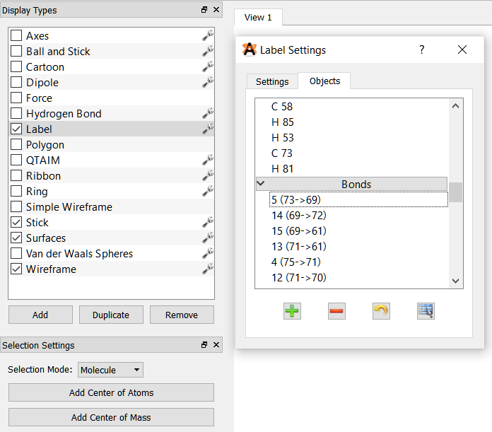

# Blacomcalc

A simple Computational Chemistry script written in Python to calculate bond lengths,
BLA value (Bond Length Alternation), center of masses (CoM) , distances between 
center of masses and bond angles of the given molecules and bonds (in `atoms_list` file), 
starting from a standard `.xyz` file. 

Also, for every molecule, it creates a BLA.dat file that can be plotted with e.g. Gnuplot.

**Features:** 

* Calculate every bond length distance between the inserted atoms, for the given molecule(s)

* Calculate the BLA according to the definition: the used formula 
is the average of single bond distances minus the average of double bonds

* Creates a BLA.dat file for every molecule that can be plotted with Gnuplot, as e.g. `BLA-1.dat` an so on

* Calculate the center of mass of the desired inserted molecules

* Calculate the distance between the desired center of masses

* Calculate the bond angle for the specified atoms 

# Usage

Clone this repo:

```bash
git clone https://github.com/mtplr/blacomcalc
```

Launch the script:

```bash
calc_bla.py molecule.xyz atoms_list > output-blacomcalc
```

# input file guide

The script reads a standard `.xyz` file containing the molecule geometry and the indications on what 
to looking for are within an input file called `atoms_list`. Data is reported according to the
following specifications:

* The first row: assign one number to the total number of molecules

* `#M` tag, then two atoms for each row, the ones you want the program to calculate the distance between, 
and a third column that specifies the bond type, everything separated by a space. This can be repeated with 
multiple molecules separated by `#M`. For the definition of the single and double bonds the user will decide (before) 
which is single and which is double based on the chemical structure given by the **neutral form**.
    
    * To quickly find the atoms involved in bonds, the [software Avogadro](https://avogadro.cc) can be used.
     It suffices to go on _Selection Tool (F11) > Selection Mode > Molecule_ and then click on settings on
     _Label_ in _Display Types_, and finally click to _Display only selective primitives_, as shown here:
     
     

* Every block must be specified within the appropriate tags: `#M...#M`, `#COM...#COM` or `#ANGLES...#ANGLES`

* Angles are calculated specifying between what atoms, e.g.: for `12 13 14` the angle centered on atom 13, which is
in the middle between 12 and 14 will be calculated

* COM and ANGLES blocks can be empty, just specify only the tags between `null`. 
For example, if you don't want to calculate the center of mass, just write:
 
```
#COM
null
#COM
```

```
#ANGLES
null
#ANGLES
```

## Example of input file 1

```
2
#M
14 13 d
15 16 d
12 13 s
12 15 s
12 10 s
10 11 s
. . .
#M
24 25 d
35 36 s
52 53 s
. . .
#M
#COM
1 2
. . .
#COM
#ANGLES
12 13 14
. . .
#ANGLES
```

The example above means: "calculate the distance between atoms 14 and 13, which corresponds to 
a double bond" and so on, for two molecules. Finally, calculate the center of mass between the molecule 1 and 2
and the bond angle between the atoms 12 13 and 14.

`s` indicates a single bond and `d` a double.

## Example of input file 2

This will calculate only the BLA value for one molecule, and one bond angle between three atoms.

```
1
#M
14 13 d
15 16 d
12 13 s
12 15 s
12 10 s
10 11 s
. . .
#M
#COM
null
#COM
#ANGLES
12 13 14
#ANGLES
```

## Get data from .mol files

A tool to extract bond information in the way Blacomcalc reads it, is implemented: **convert-mol.py**.

You can launch it as:

`convert-mol.py mol_file`

It can be interesting to convert the .xyz file in a .mol file using eg. Avogadro 
or [OpenBabel](http://openbabel.org/wiki/Main_Page) first, and then run the script.

This way it is possible to extract useful information to build the `atoms_list` file, since it contains
the couple of atoms for each bond and it specifies what bond (bond order) it is involved the depicted form 
(1 = single, 2 = double, 3 = triple, 4 = aromacity).

The **.mol** file posseses this "turning point":

```
...
   -4.9566   -2.6804    1.3230 C   0  0  0  0  0  0  0  0  0  0  0  0
   -3.9603   -3.5558    2.9163 H   0  0  0  0  0  0  0  0  0  0  0  0
   -5.1669   -2.3024   -0.3827 S   0  0  0  0  0  0  0  0  0  0  0  0
   -0.3744   -3.5300    3.2906 H   0  0  0  0  0  0  0  0  0  0  0  0
  1  2  1  0  0  0  0
  1 11  1  0  0  0  0
  2 10  1  0  0  0  0
  3  6  1  0  0  0  0
...
```

Here, e.g. `1  2  1  0  0  0  0` means: "single bond formed by atoms 1 and 2", and so on. The script parses this in order to get such lines in a form `1 2 s`.

# .xyz file

It can be generated with Avogadro, Molden, Gaussian...

Example of file generated with Avogadro:

```
25

C         -2.03043       -7.02776        1.91131
C         -3.02001       -6.11648        1.55490
C         -2.55205       -4.85898        1.17223
C         -0.74691       -6.48160        1.80939
S         -0.96570       -4.92699        1.27622
C         -3.36434       -3.78577        0.76351
...       ...             ...            ...
```

where the number `25` indicates the number of atoms in the molecule, followed by an empty line.

## Example

If you launch the example files here enclosed in _Quickstart_ folder, with `pyrl.xyz` as geometry 
and `atoms_list` as the input file, it is possible for example to compare the calculated bond 
lengths obtained here against e.g. the Avogadro molecule output [(picture here)](img/BL_avogadro.png).

The overall printed output example is reported in (`output-blacomcalc`).

# License

Author: (c) Matteo Paolieri, University of Cologne

License: MIT (see LICENSE)

